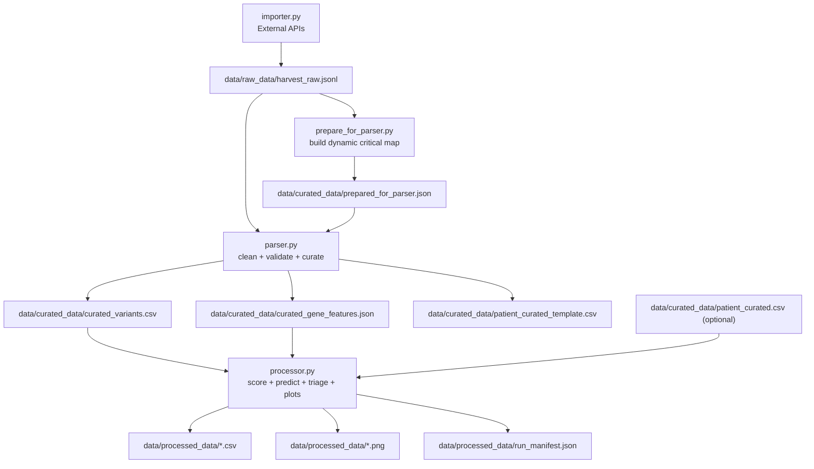

# ER-Stress Genotype Severity Pipeline

This repository implements a **data-driven, gene-aware severity framework** for ER-stress genes, with a simplified structure and explicit end-to-end flow.

The pipeline is designed to answer one practical question:

**Can we rank variant/genotype severity from existing evidence well enough to prioritize wet-lab work only where uncertainty is high?**

This is a triage-and-prediction system, not a mechanistic replacement for biology experiments.

---

## 1) Project Philosophy

### 1.1 What the pipeline is trying to do

The model generalizes a WFS1-style rule:

1. Variant molecular class matters.
2. Where the variant hits in the protein matters.

This is applied to the core gene set:

1. `WFS1`
2. `CISD2`
3. `EIF2AK3`
4. `IER3IP1`
5. `INS`

### 1.2 What counts as success

1. Higher-scored variants/genotypes are enriched for stronger pathogenic signals.
2. For genes with curated patient rows, stronger genotype scores trend toward earlier onset.
3. Decision outputs clearly identify which cases can be deprioritized versus which should be moved to targeted functional validation.

### 1.3 What this is not

1. It is not a mechanistic proof engine.
2. It does not remove the need for wet-lab in contradictory cases.
3. It does not infer causality from one data source alone.

---

## 2) Minimal Code Structure

Only five pipeline files are required:

1. `/Users/kvand/Documents/Diabeties/config.py`
2. `/Users/kvand/Documents/Diabeties/importer.py`
3. `/Users/kvand/Documents/Diabeties/prepare_for_parser.py`
4. `/Users/kvand/Documents/Diabeties/parser.py`
5. `/Users/kvand/Documents/Diabeties/processor.py`

Data folders are intentionally simple:

1. `/Users/kvand/Documents/Diabeties/data/raw_data`
2. `/Users/kvand/Documents/Diabeties/data/curated_data`
3. `/Users/kvand/Documents/Diabeties/data/processed_data`

---

## 3) End-to-End Flow



---

## 4) Core Concepts and Definitions

### 4.1 Variant, allele, genotype

1. **Variant**: one unique sequence change (here tracked by ClinVar Variation ID + HGVS fields).
2. **Allele score**: severity score assigned to one variant.
3. **Genotype score**: combined score across two alleles for one patient.

### 4.2 Variant class buckets

Derived from VEP consequence terms:

1. `lof_truncating`: high-impact truncating classes.
2. `splice`: splice donor/acceptor/region classes.
3. `inframe_indel`: in-frame insertions/deletions and related protein-altering classes.
4. `missense`: amino acid substitution.
5. `synonymous`: coding change with no amino acid change.
6. `cnv_sv`: structural/copy-number style calls.
7. `other`: fallback category.

### 4.3 Critical region

A region bucket is marked critical from **dynamic UniProt-derived labels per gene**:

1. Importer fetches UniProt entries and feature tracks (TM, topology, domains, signal peptide, chain, propeptide, disulfide).
2. `prepare_for_parser.py` derives `critical_region_map` and saves it to `/Users/kvand/Documents/Diabeties/data/curated_data/prepared_for_parser.json`.
3. Parser loads that file if it exists; if missing, parser auto-builds it from raw JSONL and then uses it.
4. `is_critical_region` is computed from that prepared map, so the critical set updates from current UniProt annotations.

### 4.4 Inheritance-aware genotype aggregation

1. Recessive genes: `genotype_score = allele1 + allele2`
2. Dominant genes: `genotype_score = max(allele1, allele2)`

### 4.5 AUC

**AUC (Area Under ROC Curve)** measures ranking quality:

1. `0.5` is random ranking.
2. `1.0` is perfect separation.
3. The interpretation is: probability that a random pathogenic-like case is ranked above a random benign-like case.

---

## 5) `config.py`: Single Source of Truth

`config.py` controls:

1. Paths for all raw/curated/processed artifacts.
2. All external API URLs.
3. Scientific defaults (class weights, critical bonus, inheritance map).
4. Scoring thresholds and endpoint settings.
5. Data directory bootstrapping via `ensure_data_directories()`.
6. Path for prepared parser cache JSON (`prepared_for_parser.json`).

No JSON config files are required in the simplified architecture. The only JSON added by this flow is a generated prep artifact (`prepared_for_parser.json`), not a user-maintained config.

---

## 6) `importer.py`: External Data Ingestion

### 6.1 Databases used and why

1. **ClinicalTables ClinVar variants API**
   - Fast gene-level variant enumeration.
2. **Ensembl VEP**
   - Consequence terms and protein position.
3. **UniProt**
   - Reviewed accession and protein features (domains, transmembrane, topology).
4. **NCBI Variation API**
   - HGVS to SPDI to rsID fallback normalization.
5. **ClinVar ESummary (JSON)**
   - Germline interpretation fields and trait sets.
6. **ClinVar ELink (ClinVar -> PubMed)**
   - Curated literature linkage from the ClinVar record.
7. **PubMed ESearch/ESummary**
   - Fallback when ClinVar links are absent.

### 6.2 Important importer design choices

1. VEP summarization is HGVS-aware, not naïvely top-level.
2. UniProt lookup prefers reviewed entries first.
3. Importer stores UniProt feature tracks in gene records; critical-map derivation is handled separately by `prepare_for_parser.py`.
4. ClinVar enrichment calls are relevance-gated by consequence class.
5. ClinVar augmentation is cached by Variation ID.
6. Lightweight pacing avoids hammering APIs.

### 6.3 Raw output format

Importer writes a JSONL stream with two record types:

1. `record_type = gene`
2. `record_type = variant`

Default path:

- `/Users/kvand/Documents/Diabeties/data/raw_data/harvest_raw.jsonl`

---

## 7) `parser.py`: Cleaning, Validation, Curation

### 7.1 What parser validates

1. Valid JSONL line parsing.
2. Presence of `gene_symbol` and `clinvar_variation_id` for variant rows.
3. Deduplication by `(gene_symbol, clinvar_variation_id)`.
4. Tracking of rows missing HGVS or missing VEP terms.

### 7.2 What parser computes

1. `variant_bucket`
2. `region_bucket`
3. `is_critical_region` using dynamic labels from `prepared_for_parser.json`
4. cleaned ClinVar/PubMed count fields

### 7.3 Curated outputs

1. `curated_variants.csv`
2. `curated_gene_features.json`
3. `patient_curated_template.csv`
4. `curation_validation_report.json`

Current validation report example:

```json
{
  "input_variant_rows": 1423,
  "output_curated_rows": 1423,
  "duplicates_skipped": 0,
  "missing_gene_symbol": 0,
  "missing_variation_id": 0,
  "rows_with_missing_hgvs": 2,
  "rows_without_vep_terms": 55
}
```

---

## 8) `processor.py`: Scoring, Prediction, Triage, Plots

### 8.1 Variant severity score

Formula used:

1. `allele_points = class_weight + critical_bonus (if critical)`
2. `score_bin` based on thresholds:
   - `low` < 2
   - `mild` >= 2
   - `moderate` >= 4
   - `high` >= 6
   - `very_high` >= 8

### 8.2 Variant-level prediction

Target:

1. `pathogenic_binary` from ClinVar benign-like vs pathogenic-like labels.

Baselines:

1. `lof_binary` baseline
2. `critical_binary` baseline

Metrics:

1. AUC (score model and baselines)
2. Accuracy, precision, recall, F1 at threshold (default 4.0)

### 8.3 Decision and triage logic

For each variant row:

1. Computes confidence score using evidence volume + model signal + mapping status.
2. Flags major discordance when prediction conflicts with ClinVar direction.
3. Sets `needs_wetlab_validation` for low-confidence/discordant profiles.
4. Assigns decision tier:
   - `Tier_A`
   - `Tier_B`
   - `Tier_C`
   - `Tier_D`

### 8.4 Optional patient processing

If a populated curated patient CSV is provided, processor computes:

1. genotype score and genotype score bin
2. mapping status (`both_mapped`, `one_mapped`, `none_mapped`)
3. endpoint summaries by score bin
4. onset swarm plot for the primary endpoint

### 8.5 Reproducibility

`run_manifest.json` records:

1. run timestamp
2. active config snapshot
3. input/output file hashes
4. runtime environment overrides for plotting backend/cache

---

## 9) Current Output Schemas (exact headers)

### 9.1 `variant_processed.csv`

`gene_symbol,clinvar_variation_id,hgvs_c,hgvs_p,dbsnp_rsid,variant_type,consequence_terms,impact,transcript_id,protein_start,protein_end,variant_bucket,region_bucket,is_critical_region,clinvar_clinical_significance,pathogenic_binary,clinvar_review_status,clinvar_last_evaluated,clinvar_conditions,clinvar_pubmed_count,pubmed_count,uniprot_accession,allele_severity_points,score_bin`

### 9.2 `variant_prediction_summary.csv`

`gene_symbol,n_labeled,n_pathogenic_like,n_benign_like,auc_score,auc_baseline_lof_binary,auc_baseline_critical_binary,threshold,accuracy_at_threshold,precision_at_threshold,recall_at_threshold,f1_at_threshold`

### 9.3 `decision_tiers.csv` and `priority_ranked.csv`

`gene,variant_or_genotype_id,predicted_severity,score_bin,confidence_score,confidence_level,major_discordance,needs_wetlab_validation,decision_tier,reason_codes`

### 9.4 `patient_processed.csv`

`patient_id,gene,allele1_variation_id,allele2_variation_id,allele1_points,allele2_points,genotype_score,genotype_score_bin,inheritance_mode,mapping_status,dm_onset_age,oa_onset_age,hl_onset_age,last_followup_age,zygosity,source_pmid,registry_id`

---

## 10) Key Figures and How to Read Them

### 10.1 AUC comparison across genes


How to read:

1. Blue dot = score model AUC.
2. Orange square = LOF-only baseline AUC.
3. Purple diamond = critical-only baseline AUC.
4. Horizontal line span = range across these models for that gene.

Interpretation rule:

1. If blue > both baselines, combined model adds value.
2. If blue ~ one baseline, that baseline dominates model behavior.
3. If blue < baseline, model likely needs gene-specific adjustment.

### 10.2 Pathogenic enrichment by score bin


How to read:

1. Rows = genes.
2. Columns = score bins.
3. Cell value = pathogenic-like fraction in that bin.
4. Darker/higher values in higher bins support expected ordering.

### 10.3 Impact-region profile


How to read:

1. `high+critical` should generally carry strongest pathogenic enrichment.
2. `high_only` and `critical_only` show isolated contribution of each axis.
3. `other` is the background category.

### 10.4 Decision landscape


How to read:

1. X-axis = predicted severity points.
2. Y-axis = confidence score.
3. Orange points = cases flagged for wet-lab.
4. Blue points = lower immediate experimental priority.

### 10.5 Diabetes onset by genotype severity (if patient data exists)


How to read:

1. X-axis = genotype score bin.
2. Y-axis = age at diabetes onset.
3. Lower ages at higher bins support severity ranking validity.
4. Always interpret with sample-size caution.

---

## 11) Running the Pipeline

### 11.1 Full standard run

1. Import raw
```bash
python3 /Users/kvand/Documents/Diabeties/importer.py \
  --genes WFS1 CISD2 EIF2AK3 IER3IP1 INS \
  --out-jsonl /Users/kvand/Documents/Diabeties/data/raw_data/harvest_raw.jsonl
```

Importer also writes a clinically-associated subset by default:

- `/Users/kvand/Documents/Diabeties/data/raw_data/harvest_raw_clinical_association.jsonl`

Default rule is `clinvar` mode (`clinvar_clinical_significance` OR `clinvar_conditions`). Use `--clinical-association-mode broad` to include ClinicalTables phenotype text as well.

2. Optional explicit prep step (parser auto-runs this if file is missing)
```bash
python3 /Users/kvand/Documents/Diabeties/prepare_for_parser.py \
  --raw-jsonl /Users/kvand/Documents/Diabeties/data/raw_data/harvest_raw.jsonl \
  --out-json /Users/kvand/Documents/Diabeties/data/curated_data/prepared_for_parser.json
```

3. Parse + curate
```bash
python3 /Users/kvand/Documents/Diabeties/parser.py \
  --raw-jsonl /Users/kvand/Documents/Diabeties/data/raw_data/harvest_raw.jsonl
```

4. Process + visualize
```bash
python3 /Users/kvand/Documents/Diabeties/processor.py \
  --curated-variants /Users/kvand/Documents/Diabeties/data/curated_data/curated_variants.csv \
  --patient-csv /Users/kvand/Documents/Diabeties/data/curated_data/patient_curated.csv \
  --out-dir /Users/kvand/Documents/Diabeties/data/processed_data
```

### 11.2 Import comparison run with higher variant limit

```bash
python3 /Users/kvand/Documents/Diabeties/importer.py \
  --genes WFS1 CISD2 EIF2AK3 IER3IP1 INS \
  --max-variants-per-gene 1000 \
  --out-jsonl /Users/kvand/Documents/Diabeties/data/raw_data/harvest_raw_1000.jsonl
```

Compare line counts:

```bash
wc -l /Users/kvand/Documents/Diabeties/data/raw_data/harvest_raw.jsonl \
      /Users/kvand/Documents/Diabeties/data/raw_data/harvest_raw_1000.jsonl
```

### 11.3 Optional: scrape SpliceAI "Other scores" for all variants

This optional step adds a secondary in-silico signal panel from the SpliceAI Lookup UI (AlphaMissense, REVEL, SIFT, PolyPhen, CADD, etc.) for correlation analysis.

Install dependency:

```bash
pip install -r /Users/kvand/Documents/Diabeties/requirements.txt
```

Run scraper (reads clinical-association raw JSONL by default):

```bash
python3 /Users/kvand/Documents/Diabeties/scraping/spliceai_other_scores_scraper.py \
  --input-csv /Users/kvand/Documents/Diabeties/data/raw_data/harvest_raw_clinical_association.jsonl \
  --out-csv /Users/kvand/Documents/Diabeties/data/processed_data/spliceai_other_scores_wide.csv \
  --out-long-csv /Users/kvand/Documents/Diabeties/data/processed_data/spliceai_other_scores_long.csv \
  --summary-csv /Users/kvand/Documents/Diabeties/data/processed_data/spliceai_other_scores_summary.csv \
  --gene-summary-csv /Users/kvand/Documents/Diabeties/data/processed_data/spliceai_other_scores_gene_summary.csv \
  --log-file /Users/kvand/Documents/Diabeties/data/processed_data/spliceai_other_scores_run.log \
  --log-every 1
```

Outputs:

1. `spliceai_other_scores_wide.csv`: one row per variant with one column per score.
2. `spliceai_other_scores_long.csv`: normalized table (variant, predictor, score, points).
3. `spliceai_other_scores_summary.csv`: overall coverage (% variants with each score).
4. `spliceai_other_scores_gene_summary.csv`: per-gene score coverage and scrape status.
5. Correlation artifacts:
   - `spliceai_other_scores_correlation_pearson.csv`
   - `spliceai_other_scores_correlation_spearman.csv`
   - `spliceai_other_scores_correlation_pearson.png`
   - `spliceai_other_scores_correlation_spearman.png`

Notes:

1. This step uses Selenium-driven browser automation and requires Chrome/Firefox.
2. By default the scraper runs in visible browser mode (for debugging); add `--headless` if you do not want a browser window.
3. The scraper waits 3 seconds between variants by default (`--sleep-seconds`).
4. Some predictors are unavailable for many variants; missingness is expected and is part of the output summaries.
5. These scores are supplementary evidence and do not replace the primary severity framework.

## 12) Practical Interpretation Guide

### 12.1 When to trust score outputs more

1. Gene has enough labeled variants.
2. Blue AUC is clearly above 0.5 and competitive with/above baselines.
3. Heatmap shows bin ordering consistent with severity expectation.
4. Confidence is medium/high and no major discordance.

### 12.2 When to escalate to wet-lab quickly

1. `needs_wetlab_validation = 1`
2. `confidence_level = low`
3. `major_discordance = 1`
4. Variant is severe by score but clinical label/context strongly disagrees.

### 12.3 Patient-level caveat

If patient rows are few, endpoint plots are hypothesis-supporting visuals, not final evidence. Treat them as direction checks pending larger curated cohorts.

---

## 13) Troubleshooting

### 13.1 Matplotlib/font cache warnings

`processor.py` already sets temporary writable paths for matplotlib and font cache; this prevents common permission failures in locked environments.

### 13.2 Empty patient outputs

Check:

1. `data/curated_data/patient_curated.csv` exists.
2. Required columns are present:
   - `patient_id,gene,allele1_variation_id,allele2_variation_id,dm_onset_age,last_followup_age`
3. Variation IDs match curated variant IDs.

### 13.3 Low mapping quality

If `unmapped_patient_fraction` is high in `patient_mapping_summary.csv`, interpretation confidence drops. Improve mapping first before over-interpreting onset signals.

---

## 14) Limitations and Next Improvements

### 14.1 Current limitations

1. Variant-level proxy labels are still proxy labels, not direct patient outcomes.
2. Gene mechanisms differ; one formula can underfit specific genes.
3. Patient cohort size and representativeness remain the main bottleneck.

### 14.2 Recommended improvements

1. Expand curated patient-onset rows with strict genotype mapping.
2. Add gene-specific adjustments for known mechanism outliers.
3. Add stronger uncertainty decomposition and optional calibration analysis.
4. Add regression tests for parser/processor outputs as the code evolves.

---

## 15) File Inventory (Current Simplified Project)

1. `/Users/kvand/Documents/Diabeties/config.py`
2. `/Users/kvand/Documents/Diabeties/importer.py`
3. `/Users/kvand/Documents/Diabeties/parser.py`
4. `/Users/kvand/Documents/Diabeties/processor.py`
5. `/Users/kvand/Documents/Diabeties/scraping/spliceai_other_scores_scraper.py` (optional Selenium mode)
6. `/Users/kvand/Documents/Diabeties/data/raw_data/*`
7. `/Users/kvand/Documents/Diabeties/data/curated_data/*`
8. `/Users/kvand/Documents/Diabeties/data/processed_data/*`
9. `/Users/kvand/Documents/Diabeties/lab_storyboard.html`

---

## 16) One-Line Summary

This pipeline turns heterogeneous public variant evidence plus optional curated patient rows into a reproducible, interpretable severity and triage system for ER-stress genes, with explicit uncertainty and collaborator-ready outputs.
